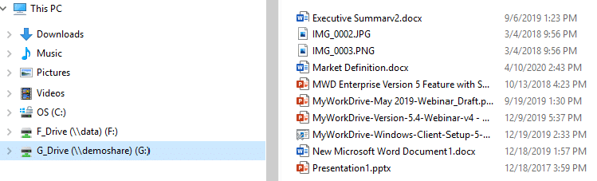

### 

# Cloud File Server for Windows

Access, share and edit your file shares securely using any web browser with our Web File Manager, Mapped Drive Clients or Mobile Apps
## Web File Manager
<kbd></kbd>
## Mapped Drive Client
<kbd></kbd>

### Secure Remote Access to your File Shares
MyWorkDrive enterprise software lets you add private cloud functionality and secure remote access to your SMB File Shares, OneDrive or SharePoint Storage in one simple interface.
### Eliminate VPN
Eliminate VPN security risks by preventing lateral network access and reduce support costs with our easy to use Web File Manager, Mapped Drive or Mobile apps over port 443 https.
### No Vendor Lock-In
With MyWorkDrive there is no Vendor Lock-in, syncing or migrating to proprietary cloud storage. All files remain stored on File Shares and storage that you control. Deploy in minutes.
### Collaborate in Office Online but keep your files local
MyWorkDrive allows users to edit and collaborate on documents within a browser using Office Online while keeping files stored on their own file servers.
### Stop Data Breaches
Prevent data breaches, data theft, ransomware, malware, and other cyber threats with built-in Data Leak Prevention (DLP) and Device Management features
### Meet Compliance Concerns
Meet security requirements and compliance standards such as FIPS, FINRA, HIPAA and the EU Data Protection Directive GDPR. 

<kbd></kbd>
<kbd></kbd>

### Trial Download:
https://www.myworkdrive.com/
